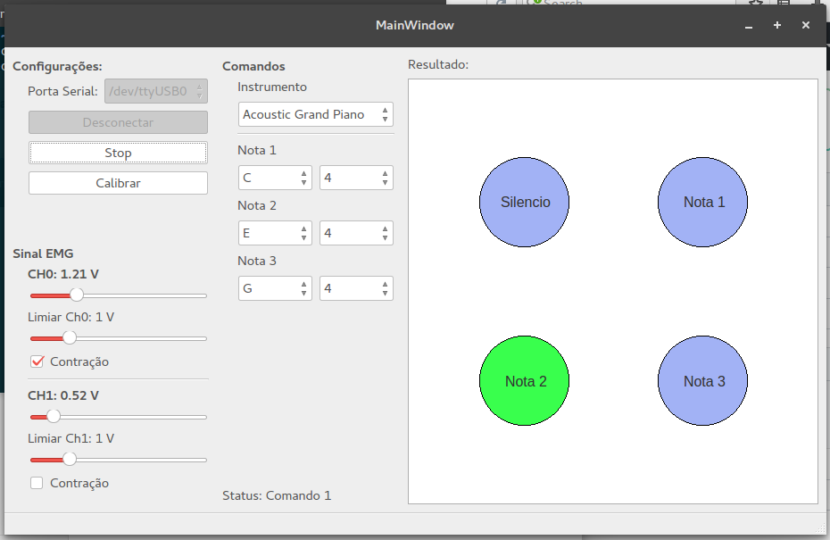

# IHMS - Myo Sound
Codigos dos projetos desenvolvidos como componentes complementares para aprovação na disciplina de IHMS no curso de Eng. Biomédica da UFU.

## Software

## Como executar

* Baixe um aquivo de sons(instrument collection para a FluidSynth library). [Opcao A -FluidR3 GM](https://pt.osdn.net/projects/sfnet_androidframe/downloads/soundfonts/FluidR3_GM.sf2/) - [Opção B - HammerSound](http://www.hammersound.net/)
* Acesse a pasta MyoSound
* Coloque seu arquivo '.sf2' nesta pasta. Caso tenha optado pela opção B. Você deve renomea-lo para 'FluidR3_GM.sf2', ou alterar no codigo a linha de seleção do arquivo.
* Execute com o python o arquivo 'myousound.py'

## Prerequisitos

* [Python 2.7](https://www.python.org/)
Com as Seguintes Bibliotecas:
* [PyQt](https://nikolak.com/pyqt-qt-designer-getting-started/) 
* [Mingus](https://bspaans.github.io/python-mingus/)
* [PySerial](https://pythonhosted.org/pyserial/)
* [QSynth](https://sourceforge.net/projects/qsynth/)
* [Outras](https://pypi.python.org/pypi/pip) que possam ser requisitadas durante a execucao.

# Licence

Este projeto esta sobre licença MIT. Consulte o arquivo licence para mais informações.

# Autores

* Ítalo
* Lorrane
* Raissa
* Caio
